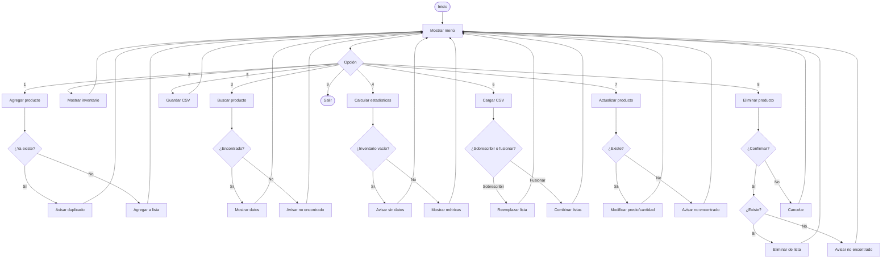

# M1S3
# 📦 Sistema de Inventario PRO

Sistema de gestión de inventario por consola desarrollado en Python. Permite agregar, buscar, actualizar y eliminar productos, calcular estadísticas y persistir datos en archivos CSV.

---

## 🗂️ Estructura del proyecto

```
inventario/
├── app.py          # Módulo principal, ejecuta el menú e interactúa con el usuario
├── servicio.py     # Lógica de negocio (agregar, buscar, eliminar, estadísticas)
├── archivos.py     # Manejo de archivos CSV (guardar y cargar)
└── inventario.csv  # Archivo generado al guardar el inventario
```

---

## ⚙️ Requisitos

- Python 3.8 o superior
- No requiere librerías externas

---

## 🚀 Cómo ejecutar

```bash
python app.py
```

---

## 📋 Menú de opciones

| Opción | Descripción |
|--------|-------------|
| 1 | Agregar producto |
| 2 | Mostrar inventario |
| 3 | Buscar producto |
| 4 | Ver estadísticas |
| 5 | Guardar inventario en CSV |
| 6 | Cargar inventario desde CSV |
| 7 | Actualizar producto |
| 8 | Eliminar producto |
| 9 | Salir |

---

## 📌 Funcionalidades

- **Agregar**: Registra un producto con nombre, precio y cantidad. No permite duplicados.
- **Mostrar**: Lista todos los productos en formato tabla.
- **Buscar**: Encuentra un producto por nombre sin distinguir mayúsculas.
- **Estadísticas**: Calcula unidades totales, valor total del inventario, producto más caro y el de mayor stock.
- **Guardar CSV**: Exporta el inventario actual a `inventario.csv`.
- **Cargar CSV**: Importa productos desde `inventario.csv` con opción de sobrescribir o fusionar.
- **Actualizar**: Modifica el precio y/o cantidad de un producto existente.
- **Eliminar**: Elimina un producto con confirmación previa.

---

## 🔄 Diagrama de flujo



---

## 💾 Formato del CSV

El archivo `inventario.csv` generado tiene la siguiente estructura:

```
nombre,precio,cantidad
Manzana,1.5,10
Pera,2.0,5
```

---

## 🧠 Decisiones de diseño

- El inventario vive en memoria (`inventario_memoria`) mientras el programa corre.
- La lógica de negocio está separada del módulo principal en `servicio.py` para facilitar su reutilización.
- El manejo de archivos está aislado en `archivos.py` para mantener responsabilidades separadas.
- Las búsquedas son insensibles a mayúsculas y minúsculas.
- La carga de CSV valida cada fila individualmente y cuenta las filas omitidas por errores.

--
